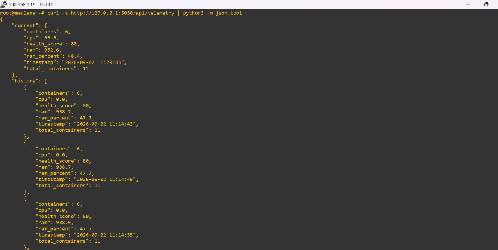
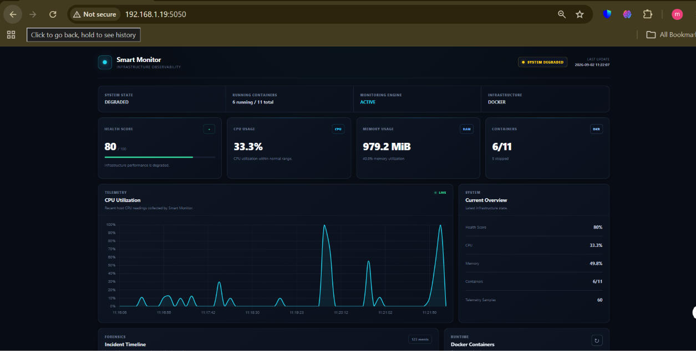
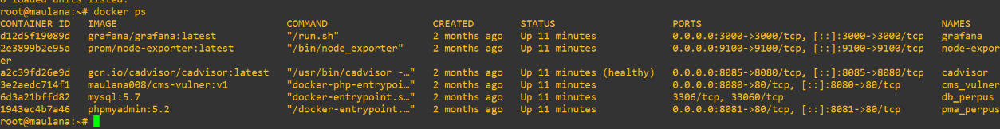
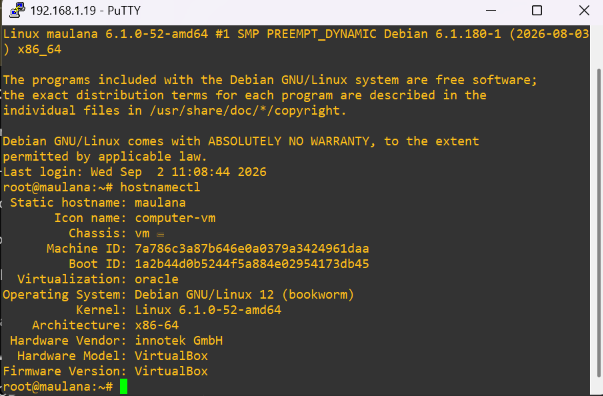
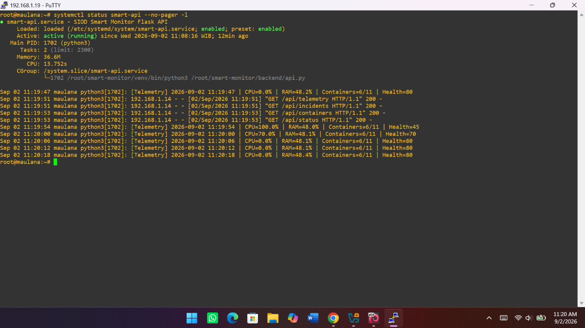
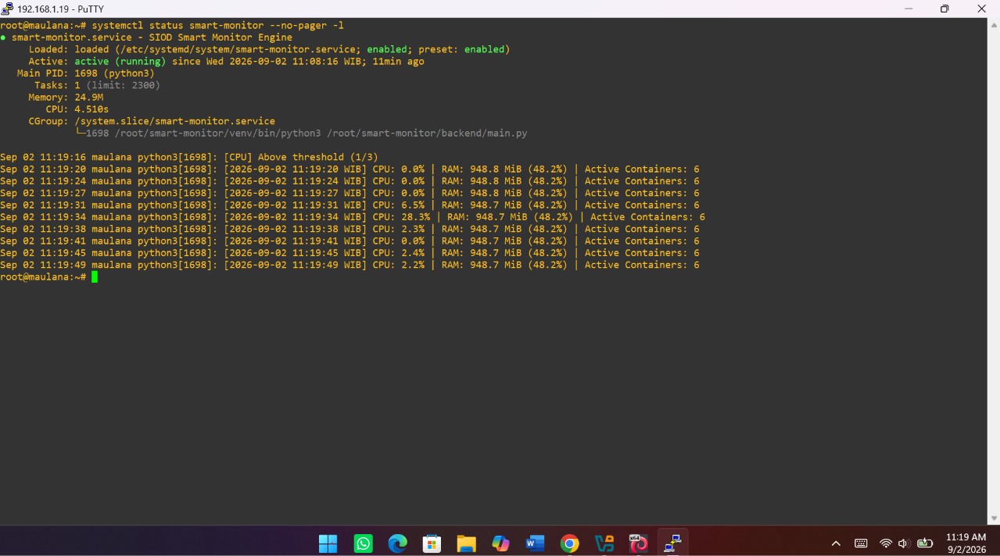

# SIOD
## Smart Infrastructure Operations Dashboard

> An infrastructure observability and operations dashboard for small businesses, schools, organizations, and homelabs.

---

## Overview

SIOD (Smart Infrastructure Operations Dashboard) is an infrastructure monitoring and operations platform designed to provide a simple operational view of server and container infrastructure.

The platform combines real-time system monitoring, Docker container monitoring, infrastructure health scoring, incident detection, recovery detection, telemetry history, and notification capabilities into a single dashboard.

SIOD was initially developed as **Smart Monitor** and has evolved into a modular Infrastructure Operations Platform.

---

## Current Features

- Real-time infrastructure monitoring
- CPU utilization monitoring
- RAM utilization monitoring
- Docker container monitoring
- Container status monitoring
- Infrastructure Health Score
- Infrastructure state classification
- Incident detection
- Incident severity classification
- Incident recovery detection
- Incident history and logging
- Telemetry history
- Flask REST API
- Interactive dashboard
- Chart.js telemetry visualization
- Telegram notification support
- Prometheus integration
- cAdvisor integration
- Node Exporter integration

---

## Infrastructure Health Score

SIOD calculates an infrastructure health score based on system resource utilization and Docker container status.

The dashboard classifies the infrastructure into three states:

| Health Score | State |
|--------------|-------|
| 85–100 | HEALTHY |
| 60–84 | DEGRADED |
| 0–59 | CRITICAL |

The score is dynamically recalculated from current infrastructure conditions.

For example, when CPU utilization reaches a critical level, the health score decreases and the dashboard state changes accordingly.

---

## Incident Detection

SIOD detects infrastructure conditions that exceed configured thresholds.

The system also detects when an infrastructure condition returns to normal.

Example:

```text
Normal
   |
   v
CPU threshold exceeded
   |
   v
CPU_SPIKE
   |
   v
CRITICAL incident
   |
   v
CPU returns to normal
   |
   v
Recovery event
````

Incident records contain information such as:

* Event type
* Severity
* Timestamp
* Current metric value
* Infrastructure metrics
* Incident message
* Recovery state

---

## Architecture

```text
                 Infrastructure
                       |
          +------------+------------+
          |                         |
          v                         v
    System Metrics           Docker Metrics
          |                         |
          v                         v
    Node Exporter               cAdvisor
          |                         |
          +------------+------------+
                       |
                       v
                  Prometheus
                       |
                       |
                       v
                SIOD Backend
                       |
          +------------+------------+
          |            |            |
          v            v            v
      Analyzer    Health Engine   Incident
                                    Manager
          |            |            |
          +------------+------------+
                       |
                       v
                   Flask API
                       |
                       v
                SIOD Dashboard
                       |
                       v
                Telegram Alerts
```

---

## Technology Stack

| Component          | Technology            |
| ------------------ | --------------------- |
| Backend            | Python                |
| API                | Flask                 |
| Monitoring         | Prometheus            |
| Container Metrics  | cAdvisor              |
| System Metrics     | Node Exporter         |
| Container Runtime  | Docker                |
| Frontend           | HTML, CSS, JavaScript |
| Visualization      | Chart.js              |
| Notifications      | Telegram Bot          |
| Service Management | systemd               |

---

## Service Architecture

SIOD separates the monitoring engine from the API layer using systemd services.

```text
smart-monitor.service
        |
        v
backend/main.py
        |
        v
Monitoring & Detection Engine


smart-api.service
        |
        v
backend/api.py
        |
        v
Flask REST API
        |
        v
SIOD Dashboard
```

This separation allows the monitoring engine and API layer to operate independently.

Both services are configured to start automatically with the system.

---

## Project Structure

```text
smart-monitor/
|
+-- backend/
|   +-- analyzer.py
|   +-- api.py
|   +-- collector.py
|   +-- health_engine.py
|   +-- incident_manager.py
|   +-- main.py
|   +-- metrics_collector.py
|   +-- monitor.py
|   +-- notifier.py
|   +-- telegram.py
|
+-- configs/
|   +-- docker-compose.yml
|   +-- prometheus.yml
|
+-- frontend/
|   +-- static/
|   |   +-- style.css
|   |
|   +-- templates/
|       +-- dashboard.html
|
+-- src/
|   +-- api/
|   +-- core/
|   +-- plugins/
|   +-- static_ui/
|
+-- logs/
|
+-- .gitignore
+-- README.md
+-- requirements.txt
```

---

## Monitoring Flow

The monitoring process follows this general flow:

```text
System / Docker
       |
       v
Metric Collection
       |
       v
Threshold Analysis
       |
       +-------------------+
       |                   |
       v                   v
Normal State         Anomaly Detected
                           |
                           v
                    Incident Created
                           |
                           v
                    Severity Assigned
                           |
                           v
                     Notification
                           |
                           v
                    Recovery Detection
```

---

## API Endpoints

The current SIOD backend provides endpoints for the dashboard to retrieve infrastructure information.

| Endpoint          | Purpose                          |
| ----------------- | -------------------------------- |
| `/api/status`     | Current infrastructure status    |
| `/api/telemetry`  | Current and historical telemetry |
| `/api/incidents`  | Infrastructure incident history  |
| `/api/containers` | Docker container information     |

---

## Development Status

### Completed

* [x] Smart Monitor foundation
* [x] Real-time infrastructure monitoring
* [x] CPU monitoring
* [x] RAM monitoring
* [x] Docker container monitoring
* [x] Container status monitoring
* [x] Infrastructure Health Score
* [x] Infrastructure state classification
* [x] Incident detection
* [x] Incident severity classification
* [x] Incident recovery detection
* [x] Incident logging
* [x] Telemetry history
* [x] Flask REST API
* [x] Dashboard redesign
* [x] Interactive telemetry visualization
* [x] Telegram notification support
* [x] Modular backend structure
* [x] systemd service deployment

### Planned

* [ ] Recommendation Engine
* [ ] Multi-host monitoring
* [ ] Website availability monitoring
* [ ] Backup monitoring
* [ ] AI Infrastructure Assistant
* [ ] Root Cause Analysis
* [ ] Predictive Analytics
* [ ] Self-Healing Infrastructure

---

## Project Goals

SIOD aims to provide a lightweight and practical infrastructure operations platform suitable for:

* Small Businesses (UMKM)
* Schools
* Organizations
* Homelabs
* Small Enterprise Environments

The primary goal is to provide actionable infrastructure visibility without requiring a complex enterprise monitoring stack.

SIOD is designed to complement existing monitoring technologies rather than replace mature platforms such as Prometheus or Grafana.

---

## Project Evolution

SIOD started as a simple monitoring project called **Smart Monitor**.

The project gradually evolved through several stages:

```text
Smart Monitor
      |
      v
Infrastructure Monitoring
      |
      v
Incident Detection
      |
      v
Health & Recovery Monitoring
      |
      v
Smart Infrastructure Operations Dashboard
      |
      v
AI-Assisted Infrastructure Operations
```

The current version focuses on reliable infrastructure visibility, monitoring, incident detection, and operational awareness.

AI-assisted analysis remains part of the project's future development direction.

---

## License

This project is licensed under the MIT License.
---
---
## 📸 Dokumentasi

### API Telemetry



### SIOD Dashboard



### Docker Containers



### System Information



### Smart API



### Smart Monitor



### Systemd Services


---

